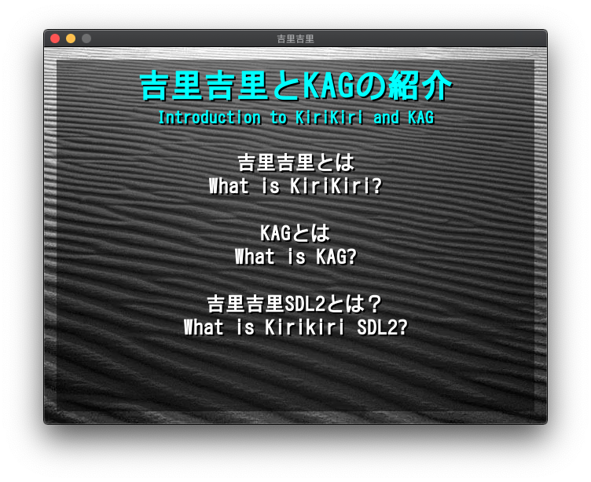

## <a name="kirikiri-sdl2"></a>Kirikiri SDL2

Kirikiri SDL2 is a port of [Kirikiri Z](https://krkrz.github.io/) that can be run on platforms supporting [SDL2](https://www.libsdl.org/), such as macOS and Linux.  

This program is maintained for projects that want to take advantage of modern hardware and platform support without needing to rewrite a large amount of code.  
If you are interested in starting a new project, check out [Ren'Py](https://renpy.org/), which have more active communities.  

This program can be used alongside a modified version of KAG (Kirikiri Adventure Game) 3.  
For more details, please see the following location: https://github.com/krkrsdl2/kag3  

Kirikiri SDL2 can also be compiled to [WebAssembly](https://webassembly.org/) with [Emscripten](https://emscripten.org/).  
A demonstration project playable in your web browser is available here: https://krkrsdl2.github.io/krkrsdl2-web-demo/  

## <a name="commercial-game-note"></a>A note on running commercial games

Running unmodified commercial games using this project is not supported.  
Please use [Wine](https://www.winehq.org/) or [Kirikiroid2](https://play.google.com/store/apps/details?id=org.tvp.kirikiri2) instead.  

## <a name="screenshots"></a>Screenshots



## <a name="community"></a>IRC Channel

Members of the Kirikiri SDL2 project can be found in the [#krkrsdl2 channel on libera.chat](ircs://irc.libera.chat:6697/krkrsdl2).  
A [Matrix](https://matrix.org/) bridged channel is also available at [#krkrsdl2:matrix.org](https://matrix.to/#/#krkrsdl2:matrix.org).  

## <a name="download"></a>Download

The following ports are automatically built from the latest source code by [Github Actions](https://github.com/features/actions).  

* [Web port](https://github.com/krkrsdl2/krkrsdl2/releases/download/latest/krkrsdl2-web.zip)
* [Win32 port (GCC, Intel, 32-bit)](https://github.com/krkrsdl2/krkrsdl2/releases/download/latest/krkrsdl2-win32-i686-gcc.zip)
* [Win32 port (GCC, Intel, 64-bit)](https://github.com/krkrsdl2/krkrsdl2/releases/download/latest/krkrsdl2-win32-amd64-gcc.zip)
* [Win32 port (Clang, Intel, 32-bit)](https://github.com/krkrsdl2/krkrsdl2/releases/download/latest/krkrsdl2-win32-i686-clang.zip)
* [Win32 port (Clang, Intel, 64-bit)](https://github.com/krkrsdl2/krkrsdl2/releases/download/latest/krkrsdl2-win32-amd64-clang.zip)
* [Win32 port (Clang, ARM, 32-bit)](https://github.com/krkrsdl2/krkrsdl2/releases/download/latest/krkrsdl2-win32-arm-clang.zip)
* [Win32 port (Clang, ARM, 64-bit)](https://github.com/krkrsdl2/krkrsdl2/releases/download/latest/krkrsdl2-win32-arm64-clang.zip)
* [macOS port](https://github.com/krkrsdl2/krkrsdl2/releases/download/latest/krkrsdl2-macos.zip)
* [macOS Application Bundle port](https://github.com/krkrsdl2/krkrsdl2/releases/download/latest/krkrsdl2-macos-appbundle.zip)
* [Ubuntu port (Intel, 64-bit)](https://github.com/krkrsdl2/krkrsdl2/releases/download/latest/krkrsdl2-ubuntu.zip)
* [Ubuntu port (ARM, 64-bit)](https://github.com/krkrsdl2/krkrsdl2/releases/download/latest/krkrsdl2-ubuntu-arm64.zip)

## <a name="source-code"></a>Source Code

The source code of this project is available at the following URL: https://github.com/krkrsdl2/krkrsdl2  

## <a name="usage"></a>Usage

To use the program, execute it in the command line in the same directory as `startup.tjs`:
```bash
/path/to/krkrsdl2
```

A startup directory or archive can be specified on the command line:
```bash
/path/to/krkrsdl2 /path/to/startup/directory
```

Command line arguments can be specified on the command line:
```bash
/path/to/krkrsdl2 -drawthread=4
```

For the web version, place the files from the Web port and `data.xp3` created by [Releaser](https://krkrz.github.io/krkr2doc/kr2doc/contents/Releaser.html) onto a web server. Once that is done, the project can be accessed from a web browser.  

## <a name="cloning"></a>Cloning

To clone the repository, please use the following command in a terminal:

```bash
git clone --recursive -b main https://github.com/krkrsdl2/krkrsdl2.git /path/to/krkrsdl2/repo
```
If you do not use the exact command above, source files will be missing files since the project uses Git submodules.

## <a name="building"></a>Building

This project can be built by using the [CMake](https://cmake.org/) build system.  
Generally, the following commands are used to build the project:  

```bash
cmake -S /path/to/krkrsdl2/repo -B /path/to/new/build/folder
cmake --build /path/to/new/build/folder
```

## <a name="running"></a>Running

Once you have built this project, change directory to one containing `startup.tjs`.  
After that is done, execute the program: `/path/to/krkrsdl2`  

## <a name="original-project"></a>Original project

Code from this project is based on the following projects:
* [Kirikiri 2](https://github.com/krkrz/krkr2)
* [Kirikiri Z](https://github.com/krkrz/krkrz) `dev_multi_platform` branch
* [simde](https://github.com/simd-everywhere/simde)
* [SDL](https://github.com/libsdl-org/SDL)
* [FAudio](https://github.com/FNA-XNA/FAudio)

## <a name="license"></a>License

The code of the Kirikiri SDL2 source (inside the `src` directory) is licensed under the MIT license. Please read `LICENSE` for more information.  
This project contains third-party components (not licensed under the GPL). Please view the license file in each component for more information.
