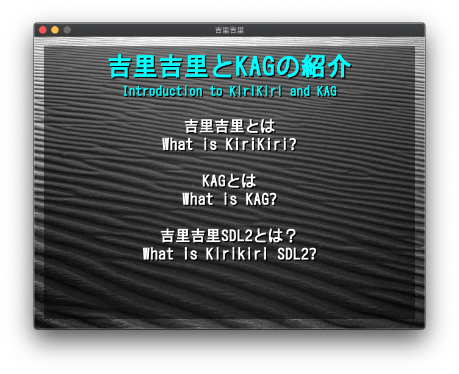

## 吉里吉里SDL2

吉里吉里SDL2は、macOSやLinuxなど、[SDL2](https://www.libsdl.org/)をサポートするプラットフォームで実行できる[吉里吉里Z](https://krkrz.github.io/)の移植版です。  

このプログラムは、大量のコードを書き直すことなく、最新のハードウェアとプラットフォームのサポートを利用したいプロジェクトのために維持されています。  
新しいプロジェクトを始めることに興味がある場合は、より活発なコミュニティがある [Suika2](https://suika2.com/) または [Ren'Py](https://ja.renpy.org/) をチェックしてください。  

このプログラムは、KAG（吉里吉里アドベンチャーゲーム）3の変更バージョンと共に使用できます。  
詳細については、次の場所を参照してください：https://github.com/krkrsdl2/kag3  

吉里吉里SDL2は[Emscripten](https://emscripten.org/)を使用して[WebAssembly](https://webassembly.org/)にコンパイルすることも可能です。  
Webブラウザーでプレイできるデモはここにあります：https://krkrsdl2.github.io/krkrsdl2-web-demo/  

## 商用ゲームの実行に関する注意

このプロジェクトを使用して変更されていない商用ゲームを実行することはサポートされていません。  
代わりに[Wine](https://www.winehq.org/)または[Kirikiroid2](https://play.google.com/store/apps/details?id=org.tvp.kirikiri2)を使用してください。    

## スクリーンショット



## IRCチャンネル

吉里吉里SDL2プロジェクトのメンバーは、[libera.chatの#krkrsdl2チャンネル](https://web.libera.chat/#krkrsdl2)で見つけることができます。  
[Matrix](https://matrix.org/)ブリッジチャネルは[#krkrsdl2:matrix.org](https://matrix.to/#/#krkrsdl2:matrix.org)でも利用できます。  

## ダウンロード

以下のポートは、[Github Actions](https://github.com/features/actions)によって最新のソースコードから自動的に構築されます。

* [Webポート](https://github.com/krkrsdl2/krkrsdl2/releases/download/latest/krkrsdl2-web.zip)
* [Win32ポート (GCC, Intel, 32-bit)](https://github.com/krkrsdl2/krkrsdl2/releases/download/latest/krkrsdl2-win32-i686-gcc.zip)
* [Win32ポート (GCC, Intel, 64-bit)](https://github.com/krkrsdl2/krkrsdl2/releases/download/latest/krkrsdl2-win32-amd64-gcc.zip)
* [Win32ポート (Clang, Intel, 32-bit)](https://github.com/krkrsdl2/krkrsdl2/releases/download/latest/krkrsdl2-win32-i686-clang.zip)
* [Win32ポート (Clang, Intel, 64-bit)](https://github.com/krkrsdl2/krkrsdl2/releases/download/latest/krkrsdl2-win32-amd64-clang.zip)
* [Win32ポート (Clang, ARM, 32-bit)](https://github.com/krkrsdl2/krkrsdl2/releases/download/latest/krkrsdl2-win32-arm-clang.zip)
* [Win32ポート (Clang, ARM, 64-bit)](https://github.com/krkrsdl2/krkrsdl2/releases/download/latest/krkrsdl2-win32-arm64-clang.zip)
* [macOSポート](https://github.com/krkrsdl2/krkrsdl2/releases/download/latest/krkrsdl2-macos.zip)
* [macOSアプリケーションバンドルポート](https://github.com/krkrsdl2/krkrsdl2/releases/download/latest/krkrsdl2-macos-appbundle.zip)
* [Ubuntuポート](https://github.com/krkrsdl2/krkrsdl2/releases/download/latest/krkrsdl2-ubuntu.zip)

## ソースコード

このプロジェクトのソース コードは、次の URL から入手できます: https://github.com/krkrsdl2/krkrsdl2  

## 使用法

プログラムを使用するには、`startup.tjs`と同じディレクトリのコマンドラインで以下を実行します：
```bash
/path/to/krkrsdl2
```

起動ディレクトリまたはアーカイブは、コマンドラインで指定できます：
```bash
/path/to/krkrsdl2 /path/to/startup/directory
```

コマンドライン引数は、コマンドラインで指定できます：
```bash
/path/to/krkrsdl2 -drawthread=4
```

Webバージョンの場合は、[Releaser](https://krkrz.github.io/krkr2doc/kr2doc/contents/Releaser.html)によって作成した`data.xp3`をWebポートと同じフォルダに配置し、Webサーバー上にアップロードします。 設置でき次第、プロジェクトはWebブラウザから動作します。

## クローニング

リポジトリのクローンを作成するには、ターミナルで次のコマンドを使用してください：

```bash
git clone --recursive -b main https://github.com/krkrsdl2/krkrsdl2.git /path/to/krkrsdl2/repo
```
プロジェクトがGitサブモジュールを使用するため、上記のコマンドを正しく使用しない場合、ソースファイルが欠落します。

## ビルディング

このプロジェクトは、[CMake](https://cmake.org/)ビルドシステムを使用してビルドできます。  
通常、プロジェクトのビルドには次のコマンドが使用されます:   

```bash
cmake -S /path/to/krkrsdl2/repo -B /path/to/new/build/folder
cmake --build /path/to/new/build/folder
```

## クイックスタート

このプロジェクトをビルドしたら、`startup.tjs`を含むディレクトリに設置してください。  
その後、次のコマンドを実行します： `/path/to/krkrsdl2`  

## オリジナルプロジェクト

このプロジェクトのコードは、次のプロジェクトに基づいています：
* [吉里吉里2](https://github.com/krkrz/krkr2)
* [吉里吉里Z](https://github.com/krkrz/krkrz) `dev_multi_platform` ブランチ
* [simde](https://github.com/simd-everywhere/simde)
* [SDL](https://github.com/libsdl-org/SDL)
* [FAudio](https://github.com/FNA-XNA/FAudio)

## ライセンス

吉里吉里SDL2ソース（`src`ディレクトリ内）のコードは、MITライセンスの下でライセンスされています。 詳細については、`LICENSE`をお読みください。  
このプロジェクトには、サードパーティのコンポーネントが含まれています (GPL に基づいてライセンスされていません)。詳細については、各コンポーネントのライセンスファイルを参照してください。  
